## Projecto Backend con JS
### Etapa Final
Se propone la creación de una API REST mediante Javascript, utilizando Node JS y Express como framework principal. Se tienen dos rutas principales formando una arquitectura de Carrito-Producto, propia de comercios electrónicos. 

#### Front End
A continuación vemos parte del front end principal. En donde se aprecia la paginación, detalles del producto que va cmabiando el container principal naranja centrado y añadir al carrito. Asi como también limpiar el carrito.
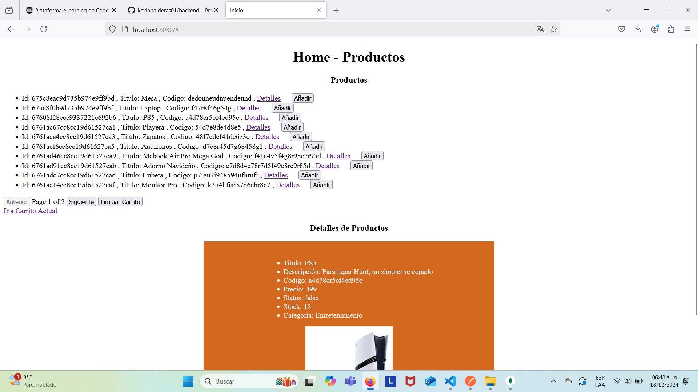  

Cambiamos detalles dando click al enlace y observamos cambios correctos.
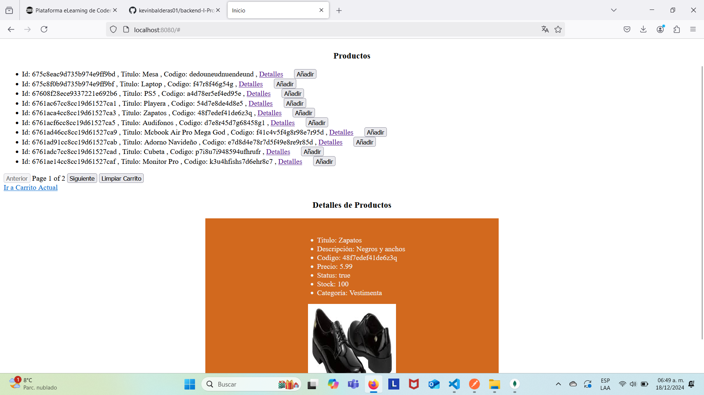  

Viendo la paginación, vemos que se habilitan y deshabilitan botones de siguiente y previa para ver los demas productos
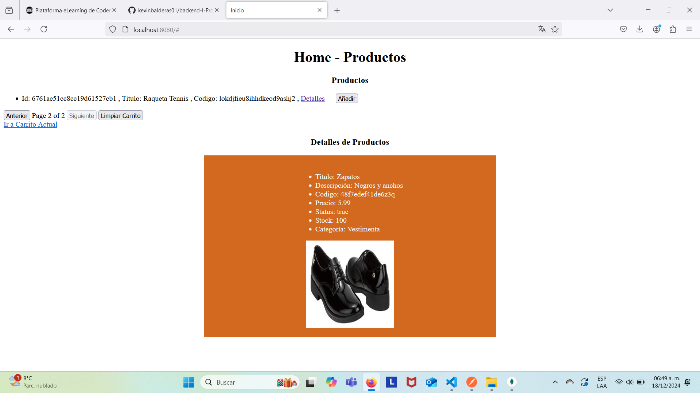  

Dando click a un enlace de una page dos, vemos que se actualiza la información correctamente.
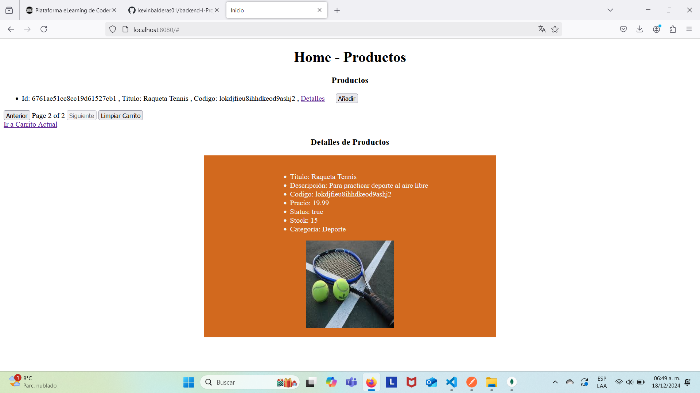  

Una vez que vamos al carrito luego de añadir los productos, vemos se actualiza correctamente
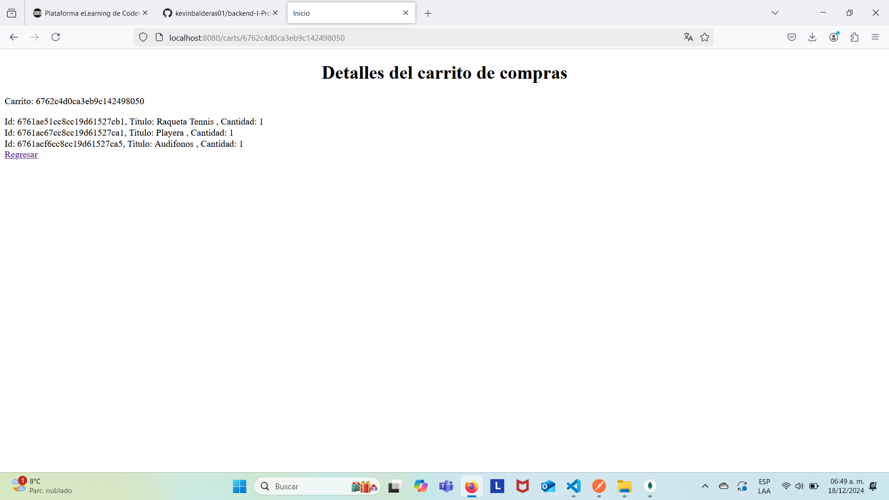  

Después, si seleccionamos limpiar carrito, vemos que se reinicia el carrito de nuevo, lo que habilita la posibilidad de añadir productos nuevos
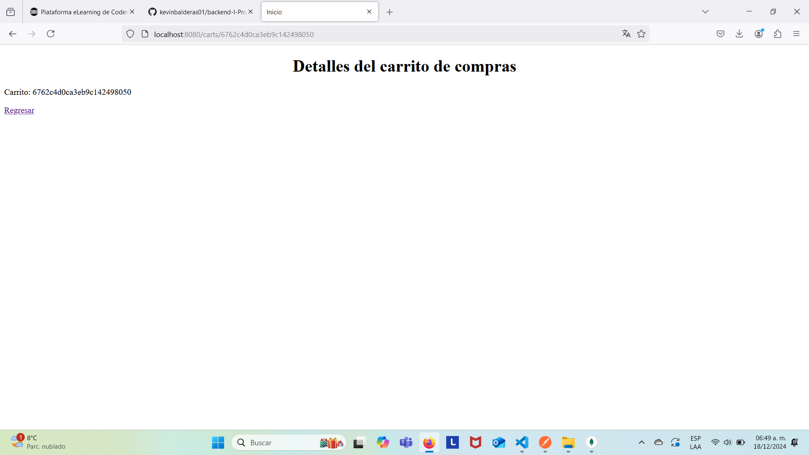  

#### BackEnd
A continuación se presentan los endpoints en postman utilizados en el desarrollo de este proyecto:

Productos */api/products*:
* */* GET Deberá listas los productos base.
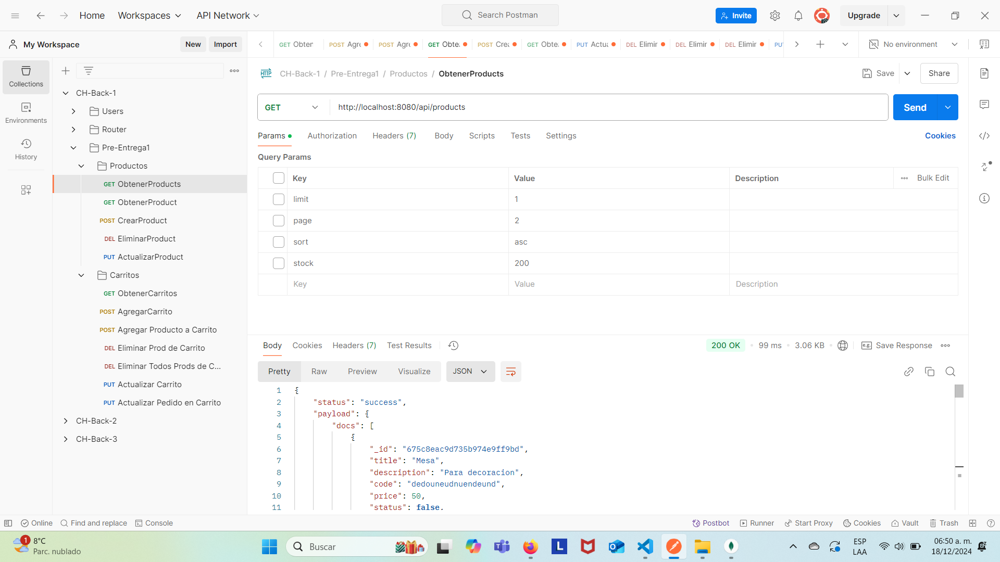  

* */:pid* - GET Deberá traer sólo el producto con el ID correspondiente.
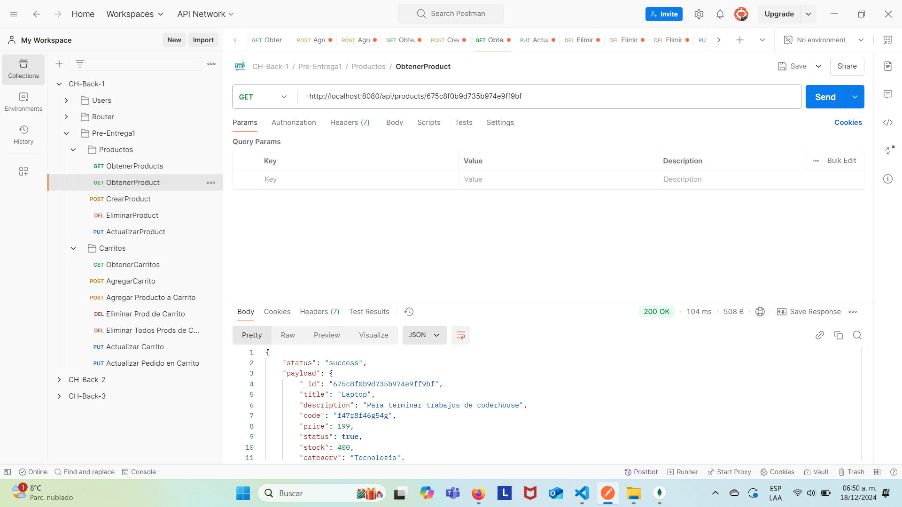  

* */*- POST Deberá agregar un nuevo producto con los campos:
        * id: Número
        * title: String
        * description: String
        * code: String
        * price: Number
        * status: Boolean --> True por defecto
        * stock: Number
        * category: String
        * thumbnail: Ruta de imagen seleccionada
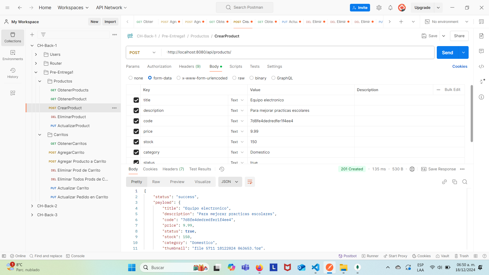  

* */:pid* - PUT Deberá tomar los campos del método POST, pero ahora para actualizar el registro.
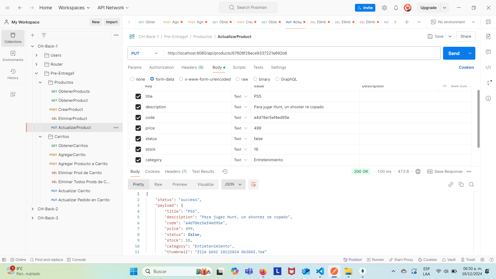  

* */:pid* - DELETE Deberá eliminar el producto con el pid indicado.
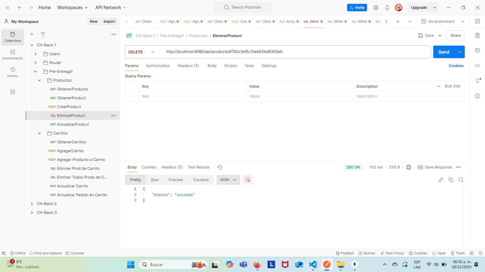  

Carrito */api/carts*:
* */* - POST Crea un nuevo carrito con nuevo ID y un arreglo vacio al inicio (implementación personal) para que así al momento de hacer el POST no se mande nada como parametro, al fin que el id se generá en automático y no me pareció viable pasar un arreglo vacio en el POST, asi que lo creé desde un inicio así.
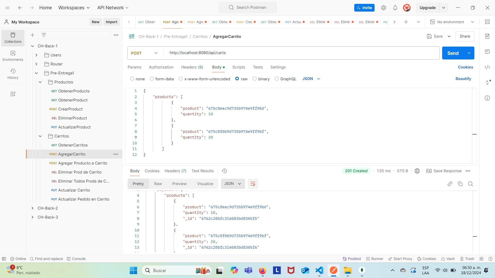  

* */* - GET Obtiene todos los carritos con todos los productos en cada uno de ellos.
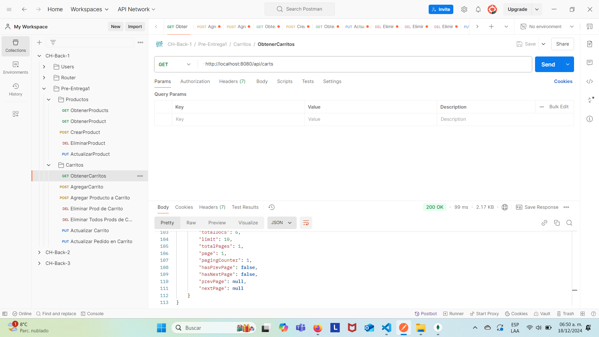  

* */:cid/products/:pid* - DELETE Eliminar del carrito seleccionado el producto seleccionado.
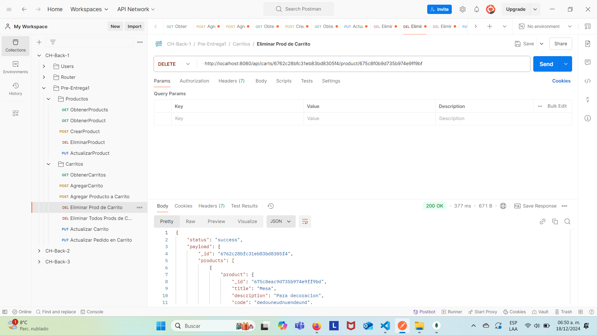  

* */:cid/products* - DELETE Eliminar del carrito seleccionado todos los productos, sin eliminar el carrito.
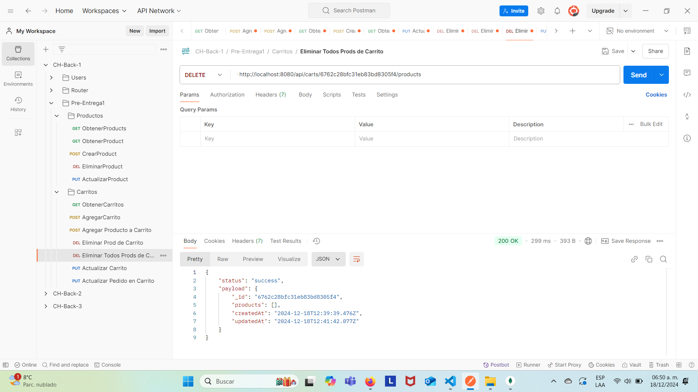  

* */:cid/products/:pid* - PUT Actualiza el carrito con una nueva cantidad del producto seleccionado, sólo se puede actualizar la cantidad de ejemplares.
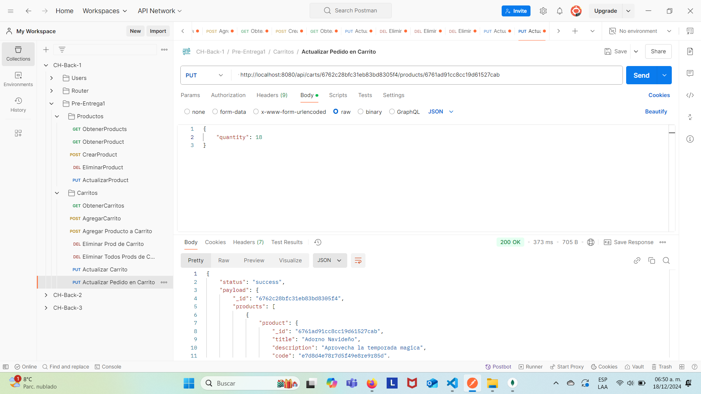  

* */:cid/* - PUT Actualiza el carrito con un nuevo arreglo de productos, como en el formato de la POST.
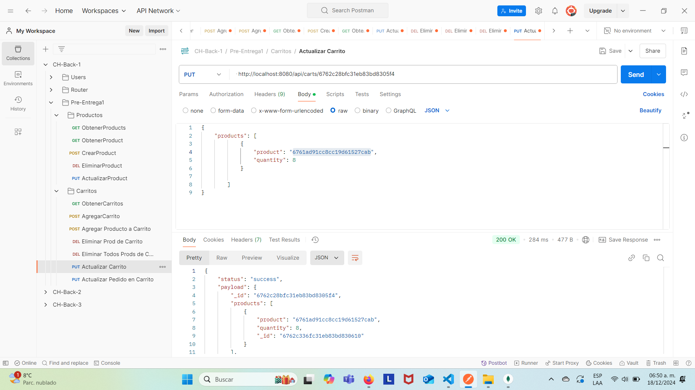  

* */:cid/product/:pid* - POST Agrega un nuevo producto al carrito en cuestión, es decir, utilizando ambos ID, añade el producto con el id pid al carrito con el id de cid. Sin duda este método fue el más laborioso de implementar, porque ya afecta ambos objetos y su interacción no es tan trivial.
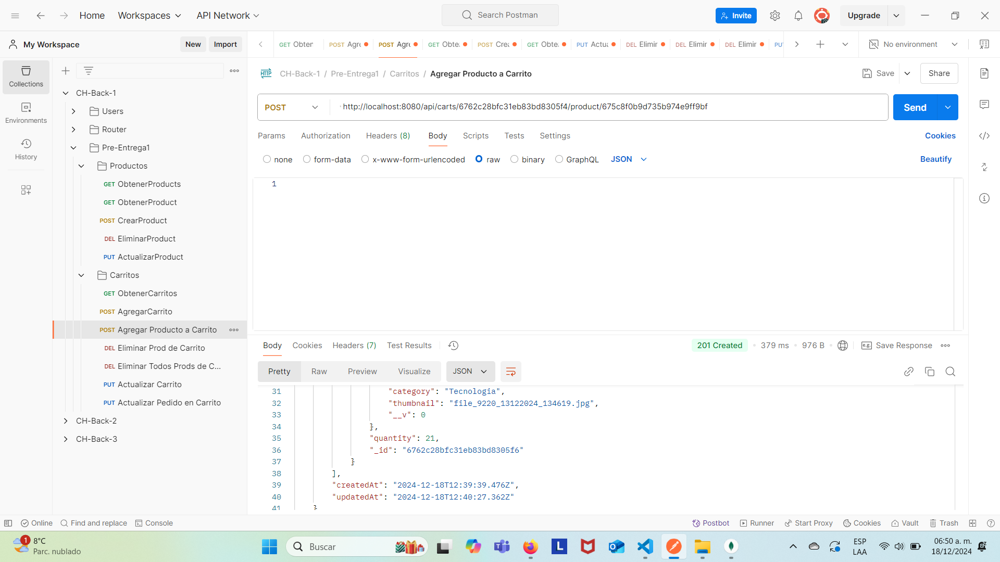  

